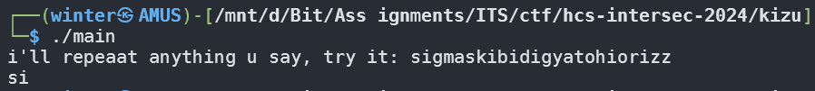
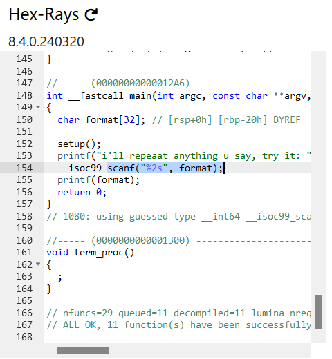
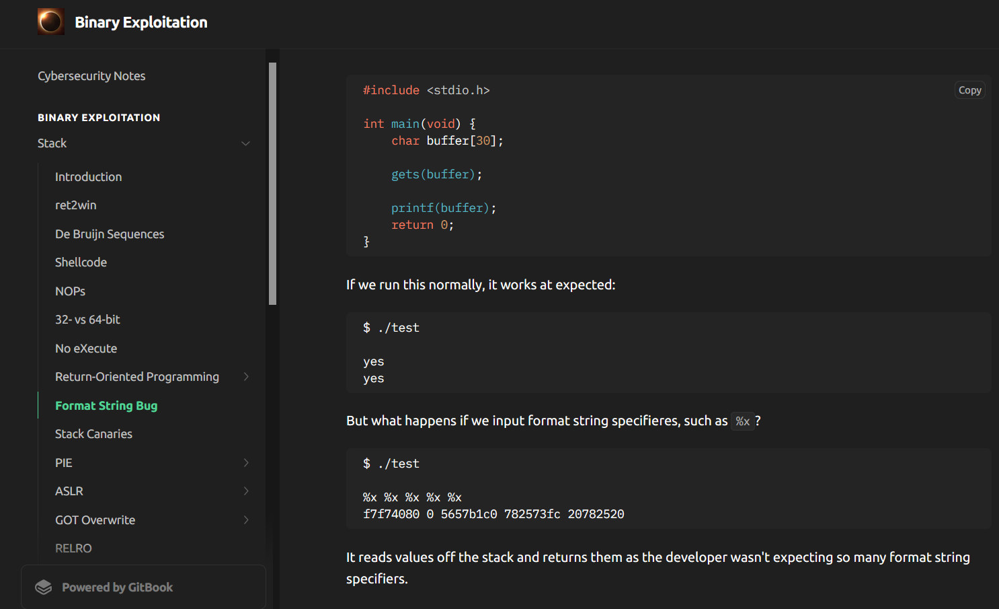
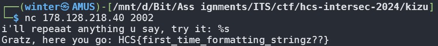

# Kizu

## Description

ini apa sih

Author: mirai

nc 178.128.218.40 2002

**Attachments: main**

## Solve

I was met with an attachment of an executable binary, that repeats pretty much only two characters of what I said.

Given my first real binary exploitation challenge that ISN'T just integer overflow, I knew by just silently reading the binary wouldn't be very effective, so I used an [online decompiler](https://dogbolt.org) to analyze what's inside.

Turns out the way it repeats the input was by using a scanf that only reads the first two characters. But then I was forced to learn the vulnerabilities of this scanf input. Thankfully, after a few hours of reading an [interesting guidebook](https://ir0nstone.gitbook.io/notes/binexp/stack/format-string), I found vulnerabilities by using format specifiers.

After inserting `%s` as the payload I immediately got the flag!

`Flag: HCS{first_time_formatting_stringz??}`