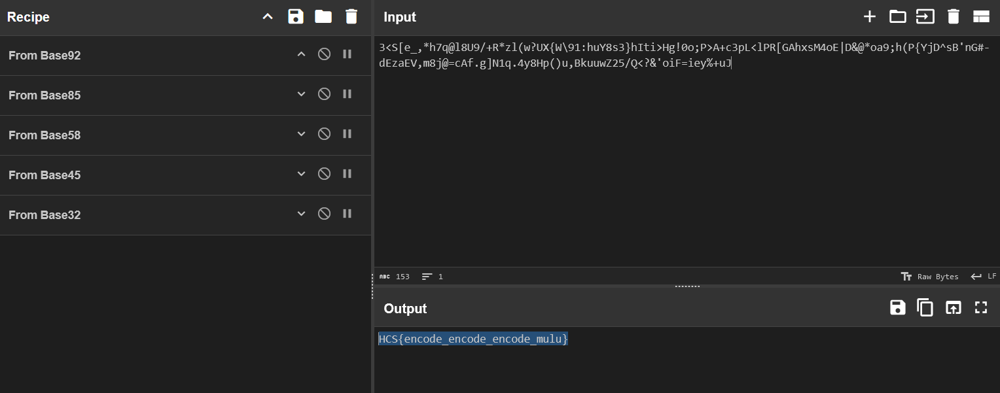

# base1234

## Description

Aku dapat pesan rahasia dari hacker paling jago saat ini, tapi aku nggak tahu cara buat men "decode" pesan ini :(

Author: daffainfo

**Attachments: encoded.txt**

## Solve

The given attachment contains a really long string with words I cant bear to understand:

```
3<S[e_,*h7q@l8U9/+R*zl(w?UX{W\91:huY8s3}hIti>Hg!0o;P>A+c3pL<lPR[GAhxsM4oE|D&@*oa9;h(P{YjD^sB'nG#-dEzaEV,m8j@=cAf.g]N1q.4y8Hp()u,BkuuwZ25/Q<?&'oiF=iey%+uJ
```
In true desperation, I just spammed random Base decryptions in CyberChef and got my flag.



`Flag: HCS{encode_encode_encode_mulu}`