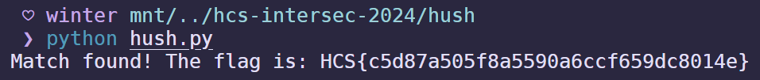

# base1234

## Description

Mari belajar "hash"

Suatu algoritma untuk mengonversi data sesuai format tertentu, yang tidak bisa dikembalikan ke data aslinya. data yang sama seharusnya memiliki hasil hash yang sama, dan data yang berbeda meskipun 1 byte seharusnya memiliki hasil hash yang berbeda. fungsi :

  1. mengamankan data tersimpan dengan format yang tidak bisa dibaca i.e "password"
  2. sebagai signature integritas suatu file/data
  3. dll

Author: idzoyy

**Attachments: chall.txt**

## Solve

It appears I was learning hashes that day. In the attachment contained instructions on the challenge:

```
aku sedang belajar menggunakan md5 hash, untuk menghasilkan hash dari flag

Waiting!!
Generating Flag Hash...
Scramble Flag...

Oh tidakkk!!! aku lupa susunan flag yang asli dan hanya tersisa hashnya saja "83106e2e86716463f5d7e6363473559c"
tolong bantu aku mencari susunan yang benar

['dc80', '5590', '5f8a', '14e}', 'a6cc', 'c5d8', 'HCS{', 'f659', '7a50']
```

There are a few key things to take from this challenge:
1. We have our hash: `83106e2e86716463f5d7e6363473559c`
2. We have our scrambled flag: `['dc80', '5590', '5f8a', '14e}', 'a6cc', 'c5d8', 'HCS{', 'f659', '7a50']`

To solve this challenge I just tried every single flag iteration using a Python script (Made by ChatGPT):

```py
import hashlib
import itertools

# Clue elements
clue = ['dc80', '5590', '5f8a', '14e}', 'a6cc', 'c5d8', 'HCS{', 'f659', '7a50']

# Function to compute MD5 hash
def compute_md5(text):
    return hashlib.md5(text.encode()).hexdigest()

# The target hash
target_hash = '83106e2e86716463f5d7e6363473559c'

# Loop over every permutation of the array
for perm in itertools.permutations(clue):
    # Assemble the string using the current permutation
    flag = ''.join(perm)
    
    # Compute the hash for this permutation
    hash_value = compute_md5(flag)
    
    # Check if it matches the target hash
    if hash_value == target_hash:
        print(f"Match found! The flag is: {flag}")
        break
else:
    print("No match found.")
```

Running the script immediately gave me the flag!



`Flag: HCS{c5d87a505f8a5590a6ccf659dc8014e}`