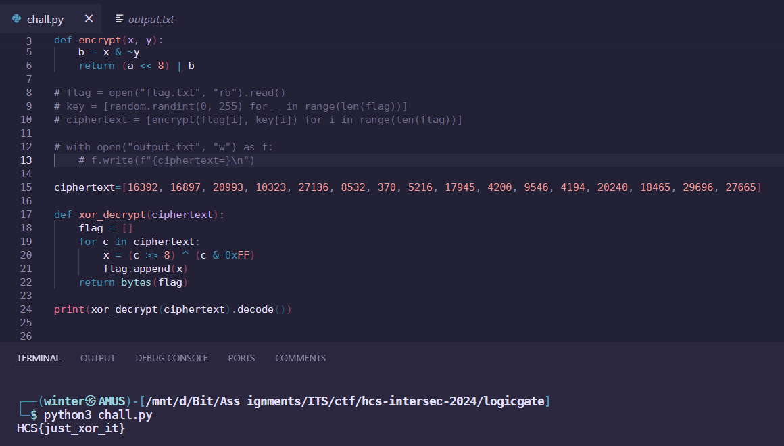

# logic-gate

## Description

Decrypt ciphertext untuk mendapatkan flag

Author: ryuk

**Attachments: chall.py, output.txt**

## Solve

I was given two attachments, one is the chall Python script:

```py
import random

def encrypt(x, y):
    a = x & y
    b = x & ~y
    return (a << 8) | b

flag = open("flag.txt", "rb").read()
key = [random.randint(0, 255) for _ in range(len(flag))]
ciphertext = [encrypt(flag[i], key[i]) for i in range(len(flag))]

with open("output.txt", "w") as f:
    f.write(f"{ciphertext=}\n")
```

And the other is the output of encryption using the previous script:

```
ciphertext=[16392, 16897, 20993, 10323, 27136, 8532, 370, 5216, 17945, 4200, 9546, 4194, 20240, 18465, 29696, 27665]
```

Shamelessly using the help of ChatGPT, I got the script to reverse the challenge algorithm, which turned out to be XOR decryption.



Running the script immediately got me the flag!

`Flag: HCS{just_xor_it}`