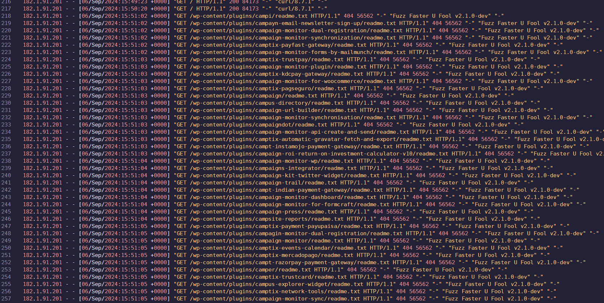
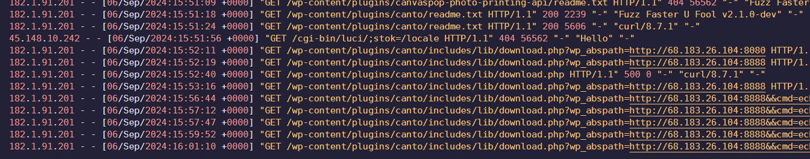
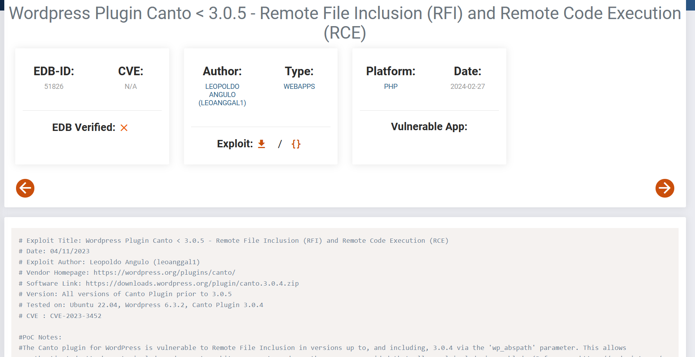
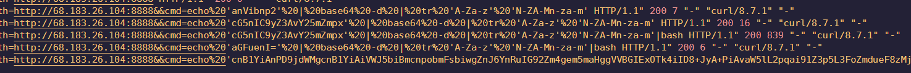
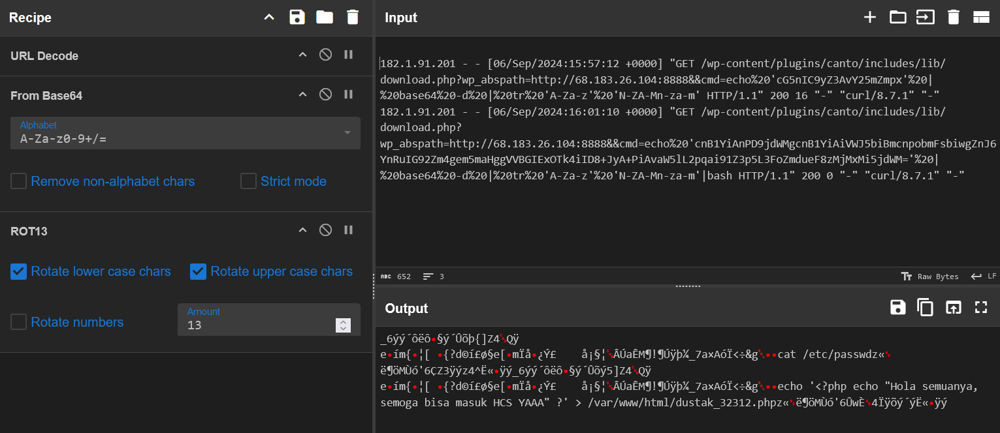

# Analisis Log

## Description

Baru juga nge-deploy website, ehhh 5 menit kemudian udah kena hack. Tolong bantu aku untuk menganalisis log ini dan jawablah pertanyaan-pertanyaan yang telah disediakan

Author: daffainfo

nc 178.128.218.40 3001

**Attachments: access.log**

## Solve

In this forensics challenge, the netcat begins by giving a bunch of questions that I had to answer based on the given access log from some sort of Wordpress app.

1. "Pukul berapa penyerang memulai melakukan fuzzing?"

The question asked for the time where the attacker started fuzzing, and the answer was `06/Sep/2024:15:51:02`

2. "Nama plugin WordPress apa yang memiliki kerentanan yang dimanfaatkan oleh penyerang?"

The question asked for the name of the exploited vulnerable plugin related with the attack, so as I scrolled down I found the name of the vulnerable plugin that did not return a bad error code, which was `canto`

3. "CVE apa yang digunakan oleh penyerang untuk mengeksploitasi server?"

The question asked for the CVE related to the attack. So after searching through ExploitDB, I found the article for "Wordpress Plugin Canto < 3.0.5 - Remote File Inclusion (RFI) and Remote Code Execution (RCE)" with the CVE of `CVE-2023-3452`

4. "Alamat IP apa saja yang dimiliki oleh penyerang?"

The question asked for the IP addresses used by the attacker. Assuming the fuzzing and the IP address placed in the canto exploit, the attacker's IPs were `68.183.26.104,182.1.91.201`

5. "File apa yang diperiksa isinya oleh penyerang, berikan full pathnya?"
6. "Apa nama file yang ditaruh oleh penyerang ke dalam server?"

The next two questions asked for the names of the files related in the attack, which I found encrypted deep within the code execution. After analyzing the commands used and some experimenting, I made a CyberChef recipe to remove URL Encoding, decode from Base 64, continued with ROT13 decoding. After decrypting the commands, I discovered a "cat `/etc/passwd`" and message echo to `dustak_32312.php`

Answering all questions correctly gave me the flag!

`Flag: HCS{asik_lho_belajar_analisis_log_server}`

