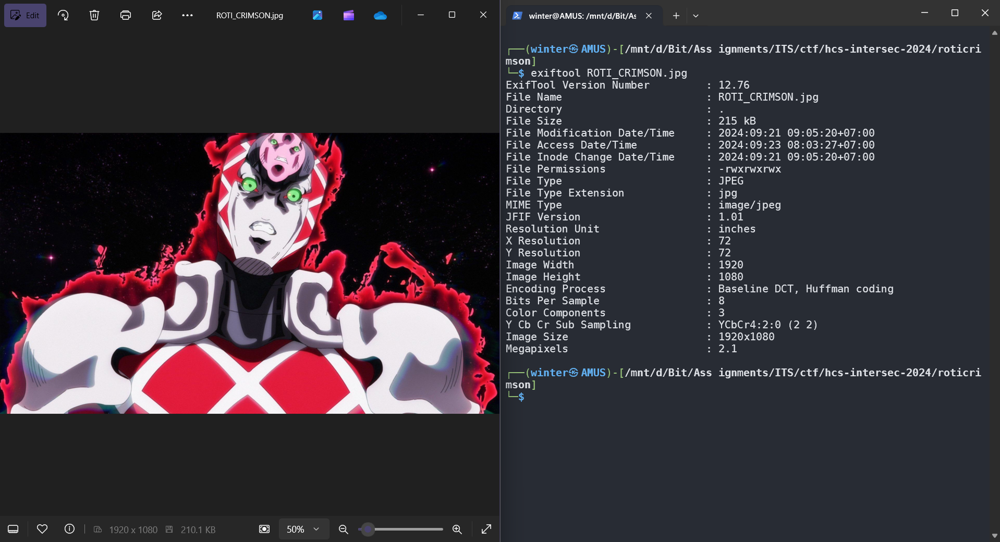

# Roti Crimson

## Description

King Crimson sangat suka roti, tapi dia menyembunyikannya entah dimana.

Author: DJumanto

**Attachments: ROTI_CRIMSON.jpg**

## Solve

Given the image of King Crimson, the first thing to do after opening the image, is to definitely check the metadata for any interesting information. As expected, it looked like just quite a normal image.

Knowing how normal this is image was, there had to be some way a message was hidden in plain sight. Thus, I discovered the art of **steganography**. I used `steghide` to extract data from the image and I was given a really long text file and the what looked like a flag, but it had a different format for some reason.

The only possible explanation was that it probably used the ROT13 cipher, and I was correct! Rotating the characters by 3 gave the correct flag format of HCS.

`Flag: HCS{St3gh1d3_4nd_R0t13_1s_4_g00d_C0mb1nat10n}`