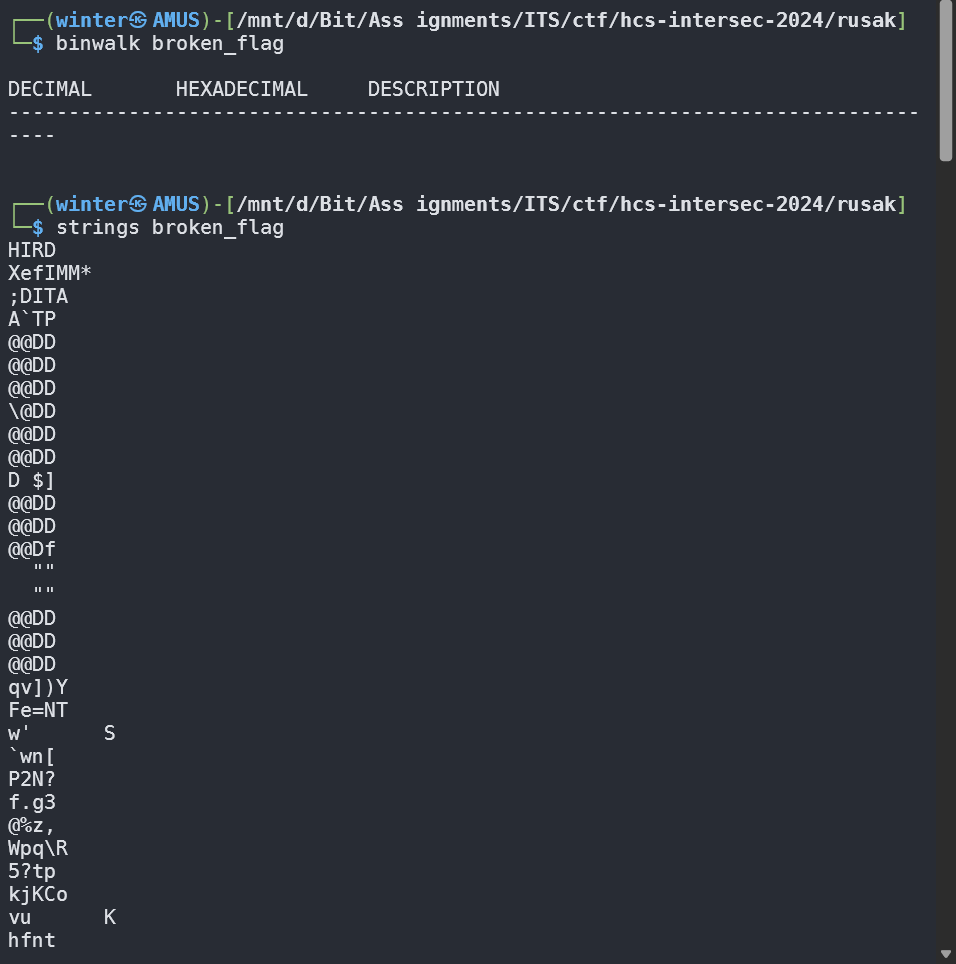
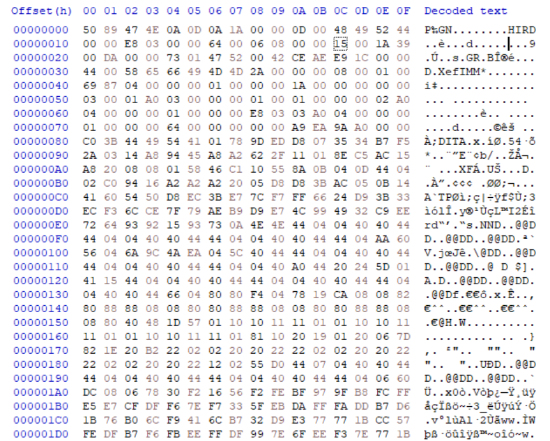
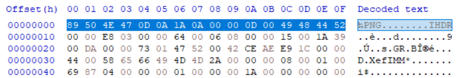
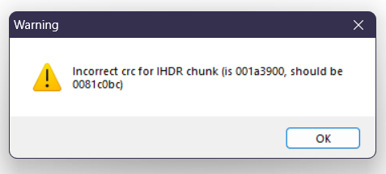
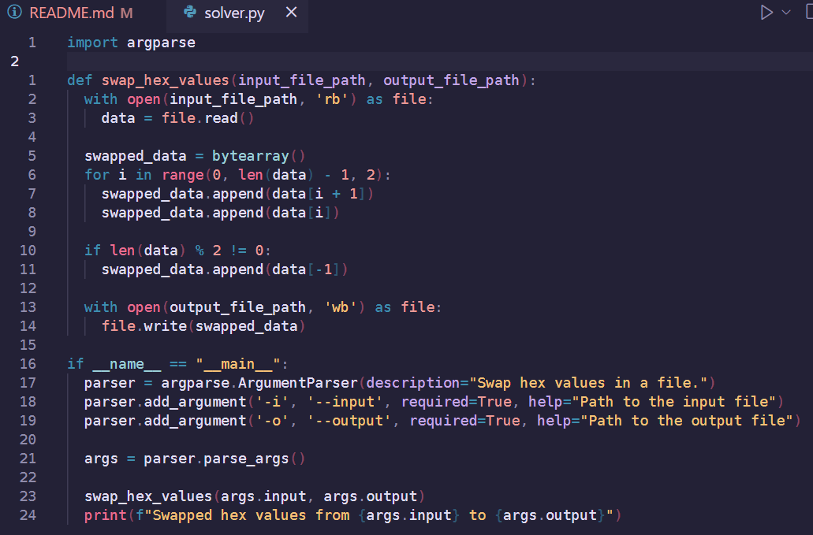
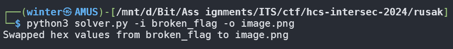
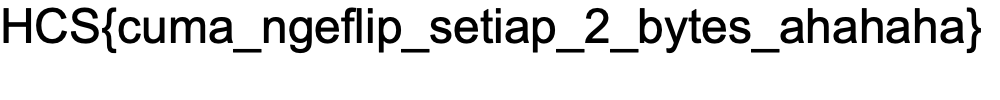

# Rusak

## Description

Dikasih file dari temen eh malah gabisa dibuka, kira-kira kenapa yak?

Author: daffainfo

**Attachments: broken_flag**

## Solve

Definitely the longest challenge I was stuck on. Anyways, it started with me trying to figure out what this file was about. I checked with `binwalk` and searched for `strings` but there was nothing of interest. I even tried decompiling it using an online decompiler but nothing popped up.

Then, it was finally time for me to use a Hex Reader tool. I opened up HxD and starting looking what's inside.

So, complete gibberish. But there was one thing that struck, it's that the header looked similar to a PNG file's header. So I tried fixing the file header to its correct form and it still kept breaking after checking it in TweakPNG.

Looking back, I was wondering. How corrupted IS this file? But after 3 trillion billion hours, I noticed one pattern. Not just the headers that are broken, but **the entire file**. Yes, every other byte is SWAPPED with each other. To fix this, I got a Python script built with the help of AI, that easily translated this pattern to fix the image.

After running the script I got a fixed image containing the flag!

`Flag: HCS{cuma_ngeflip_setiap_2_bytes_ahahaha}`