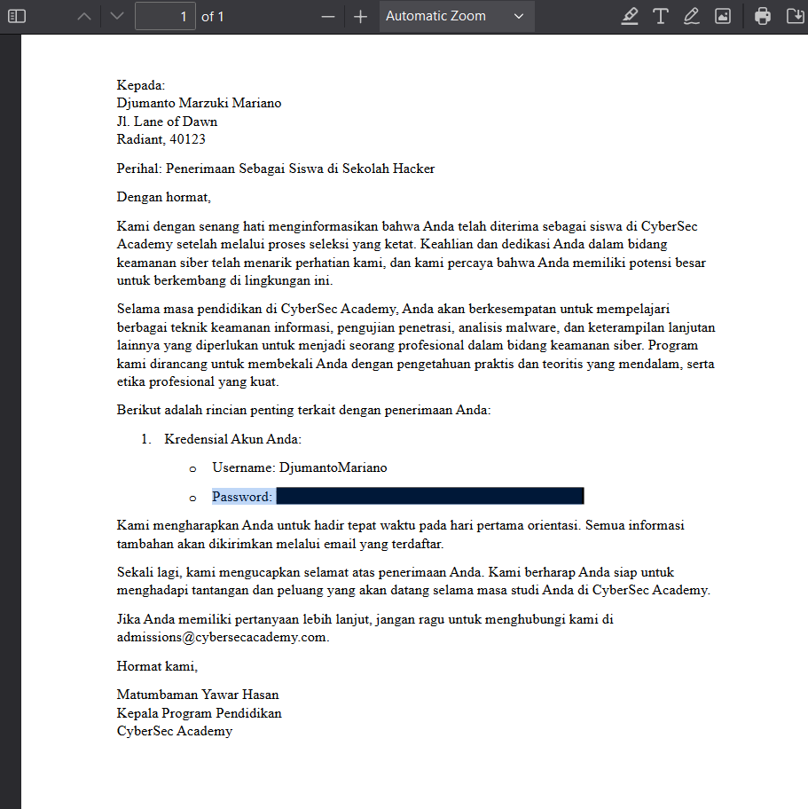

# Sekolah Hacker

## Description

DJumanto mendaftar ke sekolah hacker untuk memperdalam skill hackingnya. Namun ia mendapati bahwa kredensialnya ditutupi dengan blok hitam, sepertinya untuk menjamin kemanan datanya. Bantu DJumanto untuk membaca kredensialnya.

Author: DJumanto

**Attachments: Surat_Penerimaan_Sekolah_Hacker.pdf**

## Solve

Given a .pdf file attachment, the first thing to do is of course, open the file because surely the flag is located inside.
And as I expected, if you just copy the text hidden inside the censored (it should've been redacted!) part, you get the flag.

`Flag: HCS{H4rusnya_1n1_D1r3d4ct3d_6574937128181}`