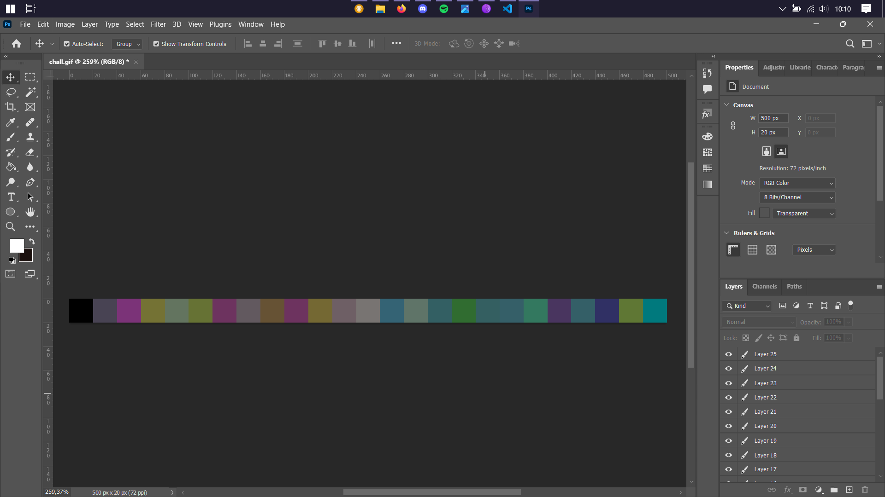
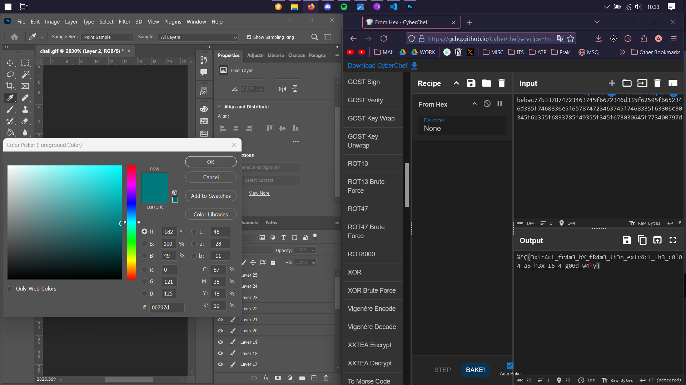

# giffff

## Description

giffff? color? color in giff?? whatever, I can't see it clearly, please help me!

Author: rootkids

**Attachments: chall.gif**

## Solve

My personal favorite challenge of the competition, this challenge is about analyzing an attached GIF to extract the code inside. Based on the clue, I immediately thought of opening the GIF to analyze each frame using PhotoShop.

As I expected, all the frames were different colors. Some unimaginable high entity sparked the genius in my brain to immediately check the color HEX codes to translate from HEX in CyberChef. And it actually gave me the flag!

`Flag: HCS{3xtr4ct_fr4m3_bY_fR4m3_th3n_extr4ct_th3_c0l04_a5_h3x_I5_4_g00d_w4y}`