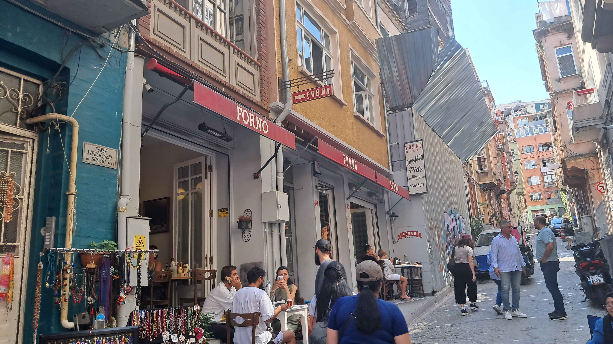

# Going Abroad

## Description

One of our member is going abroad to study! He said that there is one of this restaurant in the country he is going to. Can you find out the name of the restaurant?

Format flag:
*   Ganti spasi dengan _
*   Tidak ada special karakter
*   Semua karakter lowercase

Author: mirai

**Attachments: chall.jpg**

## Solve

Looking inside the image, I just searched the name of the restaurant and found the name of "Forno Balat" which I inputted as the correct flag.

`Flag: HCS{forno_balat}`