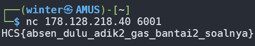

# Netcat

## Description

Netcat (atau nc) adalah utilitas baris perintah yang membaca dan menulis data melalui koneksi jaringan, menggunakan protokol TCP atau UDP. Perintah ini adalah salah satu alat yang paling kuat dalam jaringan dan persenjataan administrator sistem dan dianggap sebagai alat multi fungsi.

Sintaks dari netcat sendiri adalah sebagai berikut:

nc [options] host port

Secara default, Netcat akan mencoba untuk memulai koneksi TCP ke host dan port yang ditentukan. Jika Anda ingin membuat koneksi UDP, gunakan opsi -u.

There will be times when playing CTFs where we need to exploit a certain service that is being served on a remote machine. These type of challenges are reachable via TCP connections using tools like netcat.

nc [ip] [port]

Author: mirai

nc 178.128.218.40 6001

## Solve

41 seconds after the competition started, I was able to obtain the flag by simply using the `nc` command on my Linux terminal.

`Flag: HCS{absen_dulu_adik2_gas_bantai2_soalnya}`

