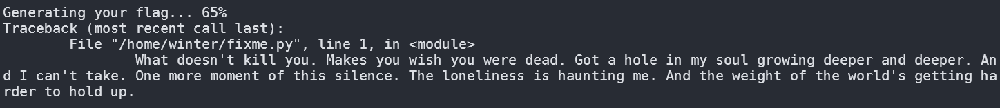
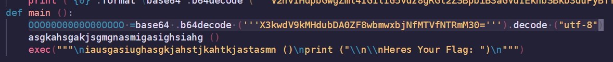
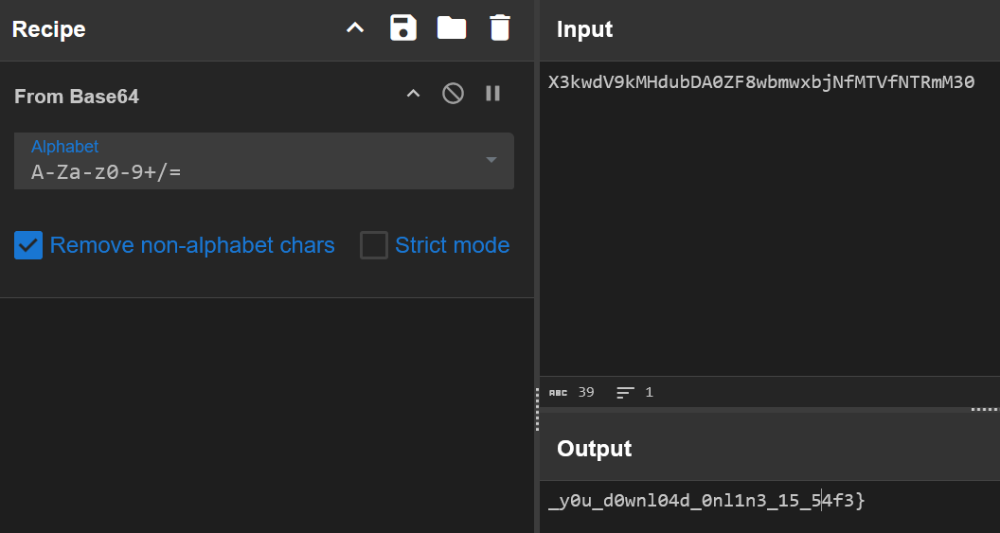
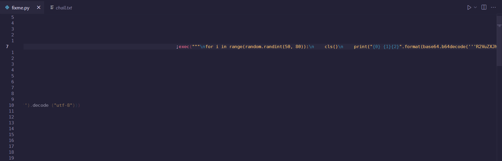
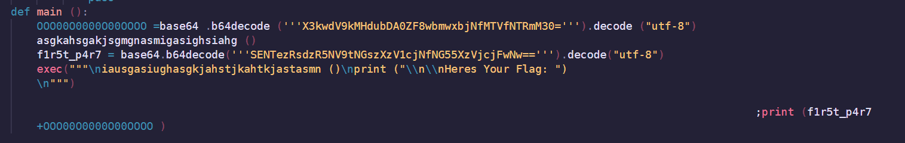
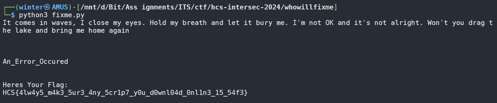

# who will fix me now

## Description

fixme.py : Can you fix her?
You : Yes, I can fix her.
fixme.py : Can you fix me now? Dive in when I'm down? Save me from myself

Author: FahrulID

**Attachments: fixme.py**

## Solve

Given the attachment file, I decided to start by running the file, raw without modifications and it created an error message after loading quite a while.

Analyzing the code, I found part of the flag after translating from Base64 in the main function, but it's only half a part!

Turns out, after scrolling to the right to read, I accidentally found the hidden code that was causing the **FAKE ERROR!!** In there it also contained the first part of the flag.

All I had to do was turn on word wrapping in VS Code (Alt+Z) by default, discovered all the hidden code that I had to combine to obtain the flag!

`Flag: HCS{4lw4y5_m4k3_5ur3_4ny_5cr1p7_y0u_d0wnl04d_0nl1n3_15_54f3}`

