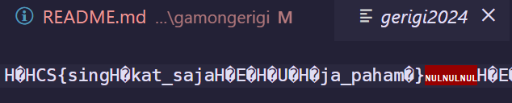

# GamonGerigi?

## Description

mau balik ke masa lalu buat ngulang gerigi :(

Author: idzoyy

**Attachments: gerigi2024**

## Solve

In this challenge, I was given a binary that I could execute. So I tried executing it, no input. Only printed outputs.

So I tried reading the raw data, and found fragments of a phrase in Indonesian "singkat saja paham", so I inputted the text as a flag, without trying out decompiler tools and it somehow worked...?

`Flag: HCS{singkat_saja_paham}`