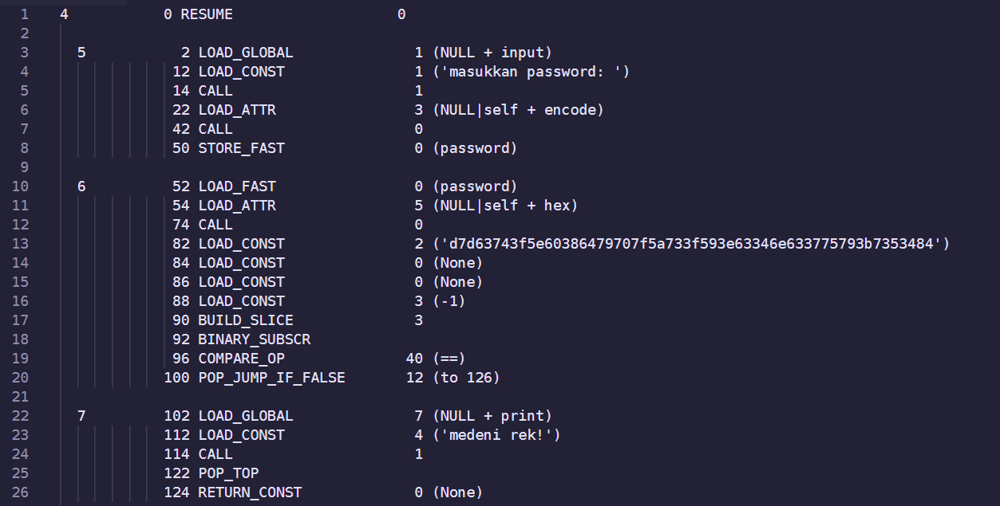
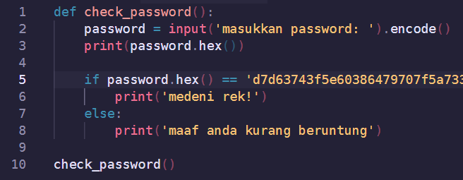
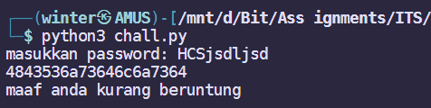
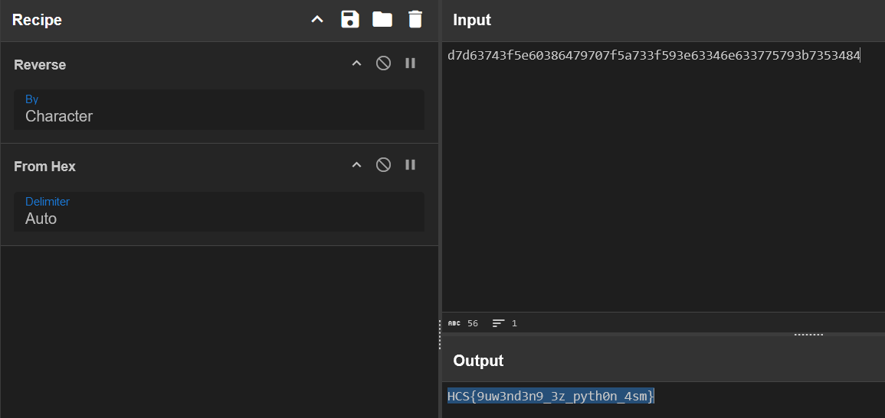

# PawangUlar

## Description

bener gasi piton itu paling gampang?

Author: idzoyy

**Attachments: chall.asm**

## Solve

In this challenge, I was given an assembly file resembling Python bytecode. It looked like a password checker program where the correct password "hash" is embedded into the code.

I translated the Assembly into Python using AI, but it was quite inaccurate. Don't only rely on AI, kids!

Looking into it further, also with the help of ChatGPT, I was able to figure out:
* The password is encrypted in hexadecimal bytes
* It's also reversed (H had the hex code of 48, and the password ended with 84)

Translating the password using CyberChef gave me the correct flag!

`Flag: HCS{9uw3nd3n9_3z_pyth0n_4sm}`