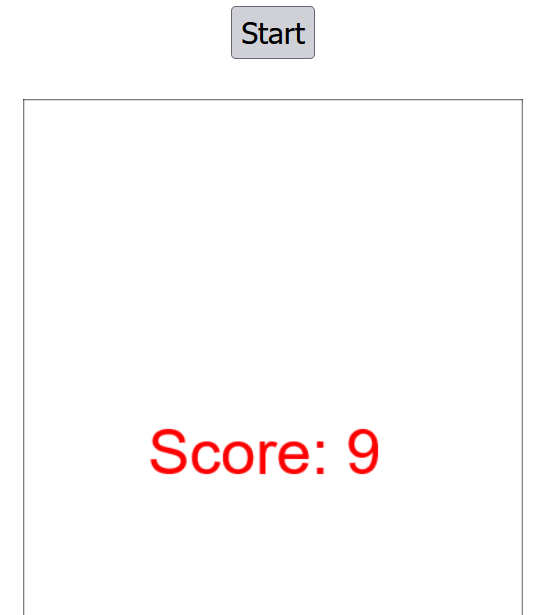

# Snake v2

## Description

Menangkan permainan ini untuk mendapatkan flag

Author: ryuk

**Attachments: dist.zip**

## Solve

In this challenge, I was given a zip file that has a snake game built using HTML & JS. It appears to obtain the flag I have to win the snake game in any way possible. So I started playing the game and noticed one part of the puzzle: **Every fruit gives 9 score points.**

Knowing I won't progress the challenge if i kept playing for 3 trillion years, I opened the JavaScript file.

Oh my god. The entire thing is on one single line. Thankfully I have the Prettier VSC extension to make it somewhat more readable. So there are a few important clues I got from analyzing this code (with the help of ChatGPT because these variables are confusing):
* The win() function is called after reaching `0xf423f` score, which is 999999 points, equivalent to getting 111111 fruit.
* The win() function takes into account an `integrityValue` a special value that controls the winning message, which also acts as the decryption key to the flag.
* Every fruit eaten adds 1337 to the `integrityValue`, which means in the ideal winning screen it will be `111111 * 1337 = 148555407`

With this knowledge in hand, I modified the win function so it triggers without the 999999 score requirement and a set integrityValue of 148555407. Doing this gave me the flag on game over!

`Flag: HCS{what_a_cheater!}`