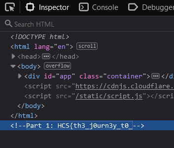
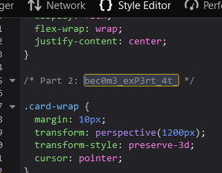
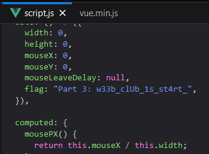
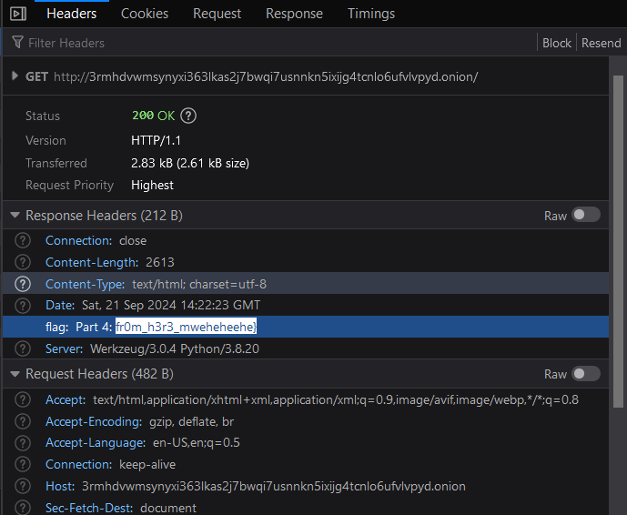

# Parted

## Description

I hear that you want to be part of HCS right? Solve this first!!!

Author: rootkids

http://3rmhdvwmsynyxi363lkas2j7bwqi7usnnkn5ixijg4tcnlo6ufvlvpyd.onion

## Solve

Looking at the link, I saw the word onion and remembered how delicious onion rings are as snacks. So I installed the TOR Browser for the first time on my laptop, and opened the link.

The link directed me to a blank website with appealing hover effects, and mostly nothing important. So this is where opened the Developer Tools and started searching inside. From what I could find, the website contains the holy trinity: HTML, CSS, and JS. Inside all the files I discovered three parts of the flag.

1. Part 1 (HTML): HCS{th3_j0urn3y_t0_ 

2. Part 2 (CSS): bec0m3_exP3rt_4t_

3. Part 3 (JS): w33b_clUb_1s_st4rt_

It turns out the challenge didn't end there as I'm missing the closing flag, so I started the hunt again. Then I stumbled upon the Network tab, where I found the flag variable inside the response.

4. Part 4 (Network): fr0m_h3r3_mweheheehe}

Combining all the parts of the flags gave me the final result!

`Flag: HCS{th3_j0urn3y_t0_bec0m3_exP3rt_4t_w33b_clUb_1s_st4rt_fr0m_h3r3_mweheheehe}`

